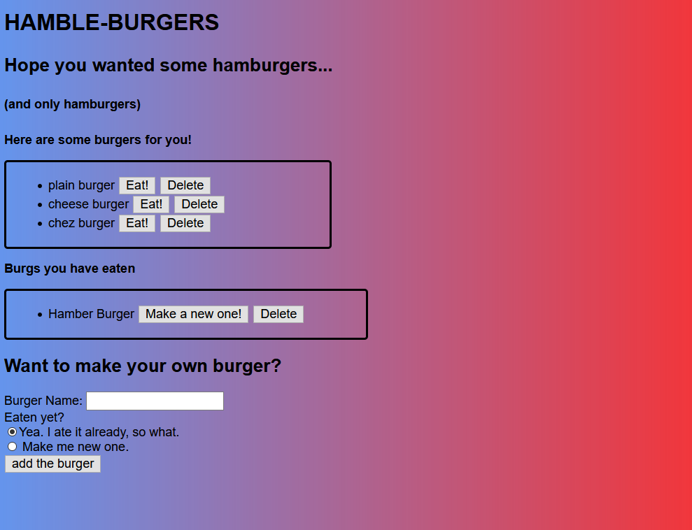

# Burger Time

## Description 

PROJECT DESCRIPTION

## Table of Contents

* [Installation](#installation)

* [Usage](#usage)

* [License](#license)

* [Contributing](#contributing)

* [Test](#tests)

* [Questions](#questions)

## Installation

To install necesarry dependencies, run the following in your terminal:

npm install express express-handlebars mysql

## Usage 

Have you ever wanted to imaginarily eat and creates hamburgers? This app will allow the use to create hamburgers, eat those hambergers, and delete those hamburgers. And, if they wanted, they could remake those burgers and eat them all over again!

## License

This project is licensed under the None license.

## Contributing

fork and pull if you like!

## Test

Enter the following to run tests on this project:

no tests provided.

## Questions

For questions you can reach out to calmanning on GitHub, or email them at calmanning@gmail.com

